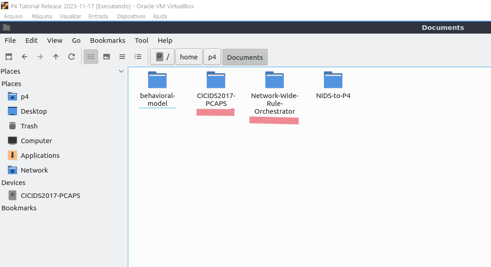

# Network-wide Rule Orchestrator

This repository contains the code and instructions to replicate the results of the paper ()[]. 

## **Table of Contents**
- [Installation process](#installation-process)
- [Repository structure](#repository-structure)
- [Replicating the experiments](#replicating-the-experiments)
- [Obtaining the baseline alerts](#obtaining-the-baseline-alerts)
- [Evaluating new topologies](#evaluating-new-topologies)

## Installation process

### 1. Install Vagrant and VirtualBox

- [Vagrant](https://developer.hashicorp.com/vagrant/install)

- [VirtualBox](https://www.virtualbox.org/wiki/Downloads)

### 2. Build the P4 virtual machine

Clone the official repository:

```
git clone https://github.com/p4lang/tutorials.git
```

```
cd tutorial/vm-ubuntu-20.04
```
Run the following command:

```
vagrant up
```

### 3. Adjust the P4 VM settings

Turn off the machine to modify the hardware settings. Extend the number of vCPU cores and memory size so it does not crash during the experiments.

The used configuration for the P4 VM was:
- 22 vCPU cores
- 146 GB of memory

Note: We used a DELL server with substantial resources for our experiments. If using a smaller configuration, carefully monitor the egress number of packets during experiments. If the egress count is significantly smaller than the input for any PCAP, consider increasing the memory space or the number of cores.

### 4. Log into the machine and clone this repository

Update the apt related packages and go to the `Documents` folder:
```
sudo apt update && cd Documents
```

Clone this repository and enter it:
```
git clone  https://github.com/HenriqueBBrum/Network-Wide-Rule-Orchestrator.git && cd Network-Wide-Rule-Orchestrator
```

### 5. Download the CICIDS2017 PCAP files and create a shared folder with the guest system

To download the CICIDS2017 PCAP files, 
1. Go to [this link](https://www.unb.ca/cic/datasets/ids-2017.html);
2. Scroll down to the end of the page;
3. Click the `Download this dataset` and fill in the required information;
4. Enter the `CIC-IDS-2017` directory and then the `PCAPs` directory;
5. Finally download the PCAP for each day of the week.

> :warning: They are big PCAPs, with over 8GB of data, so they take a while to download.

Save the PCAP files into your host machine in one folder. For the guest folder, it must be named `CICIDS2017-PCAPS` and placed at the same level as this repo's folder. The image below illustrates this:
<p align="center">
	
</p>


For more information on how to create shared folders with VirtualBox, follow these links:
- [How to Create and Access a Shared Folder in VirtualBox](https://www.makeuseof.com/how-to-create-virtualbox-shared-folder-access/)
- [How to create shared folder for virtual machine on VirtualBox](https://pureinfotech.com/create-shared-folder-virtual-machine-virtualbox/)


### 6. Install the dependencies

The last step is to run the following command to automatically install all required dependencies and configure the enviroment:

```
./install_dependencies.sh
```

> :warning: This script takes a long time to finish, be patitent.

The packages and tools installed are the following:
- tcpreplay
- matplotlib and networkx (Python)
- BMv2 (for custom high performance)
- Snort3

After this process ends, the enviroment is configured and ready to run the experiments. 

## Repository structure

```
├── assets/
├── baseline_alerts/
├── snort/
├── src/
├── testing/
├── utils/
├── .gitignore
├── install_dependencies.sh
├── README.md
```

- **`assets/`**: The images used in this README file;

- **`baseline_alerts/`**: Contains the alerts generated by Snort 3 when using the CICIDS2017 dataset as input and the following rulesets: Snort 3 Community, Snort 2 Emerging Threats, Snort 3 Registered;

- **`snort/`**: Snort folder with the configuration files, rulesets, and the logs output;

- **`src/`**: Data plane folder with the P4 code and topologies definition;
	- **`include/`**: Folder with files defining the P4 headers and the P4 parser;
	- **`topologies/`**: This folder contains the topologies used in the experiments, with the topology definitons and fowarding for the swtiches;
	- **`main.p4`**: Main P4 file, detailing the functioning of the data plane;
	- **`p4_table_entries*.config`**: The table entries to offload;

- **`testing/`**: The testing and plotting files;
	- **`dataplane_parameters_evaluation.json`**: The testing and plotting files for the dataplane parameters evaluation where the dataplane algorithms parameters are evaluated;
	- **`experiment_configuration.json`**: The configuration files for each topology. These files contanin configurations for the table entries offloading programa and the experiemnts's Mininet nodes;
	- **`final_evaluation.json`**: The testing and plotting files for the final evaluation with different offloading algorithms and topologies;

- **`utils/`**: Folder containing Python files that interact with Mininet and the P4Runtime;
	- **`offload_table_entries.py`**: File responsbile for offloading the table entries to the swtiches according to the offloading algorithm;
	- **`default.json`**: Python file responsible for creatin the Mininet enviroment and running an experiment;

- **`.gitignore`**: Files for git to ignore;

- **`/install_dependencies.sh`**: Script used in to install the depedencies and to configure the environment;

- **`/README.md`**: README file with this project's documentation.


## Replicating the experiments

There are two set of experiments to replicate: the [data plane parameters evaluation](#data-plane-parameters-evaluation), and the [final evaluation](#final-evaluation). The first evaluates different data plane configurations to decide on the best one. The latter evaluates the network-wide offloading algorithms with two topologies, linear and tree, using different memory availability scenarios in the switches.

### Data plane parameters evaluation

The data plane parameters evaluations assesses three parameters:
- The number of packets to clone for each count-min entry, or _N_.
	- The values tested are: 10, 25, 50, 100, 200, 400, 800
- The time threshold to age the count-min entries, or _T_.
	- The values tested are: 10, 25, 50.
- The width of the count-min sketch hash arrays, or _W_.
	- The values tested are: 256, 512, 1024, 4096, 16834.

> The evaluation experiments with all combinations of the three parameteres (i.e., {N(10), T(10), W(256)}, {N(10), T(10), W(512)}, etc.).

Before running the experiment, there is the need to do some adjustments in the code. First, uncomment the following line in the `utils/` file:

```
print("Installed P4 Program using SetForwardingPipelineConfig on switch "+switch_id)
switch.SetForwardingPipelineConfig(p4info=p4info_helper.p4info, bmv2_json_file_path=bmv2_json)
```
In the data plane parameters evaluation, the topology used does not have forwarding rules; it only clones suspicious packets and sends the packets to a default port. Because of this, these lines must be uncommented to install the P4 program in the data plane.

Second, uncomment the following line in the `src/main.p4` to foward packets to the default port:

```
standard_metadata.egress_spec = DEFAULT_PORT;
```

The last change is to comment (//) the following line in the `src/main.p4` since there are no IPv4 fowarding rules in the siwtche of this experriment:
 ```
ipv4_lpm.apply();
```

With these changes done, create an output folder in any location you like; for example:
```
mkdir ~/Documents/dataplane_parameters_evaluation
```

Then, run the following command in the terminal:
```
./evaluate_parameters ~/Documents/dataplane_parameters_evaluation
```

> Always provide the full path, not a relative path, to the output folder.

The complete parameters evaluation takes a LONG time. There are roughly 55 million packets being sent at a rate of 1000 packest/s (due to BMv2 limited perfromance), which traslate to 15 hours to evaluate each parameters. There are 105 combiantions, so...it takes a VERY LONG TIME. If you wish to reduce the number of parameters to evaluate, feel free to do so.

After finishing the experiments, it is time to plot them. For this, install Jupyter:"
```
pip install jupyterlab
```

In the testing folder, run the command:
```
jupyter lab --NotebookApp.iopub_data_rate_limit=1.0e10
```

Before executing the notebook's cells, update the experiment's input folder and the output folder in the Parse the parameters evaluation experiments code.
> Change the output folder to avoid collisions with the graphs of this repository.

With the folders updated, strat the kernl and run all cells to plot the graphs. That`s it, the dataplane parameters evaluation is over.


### Final evaluation


### Run individual experiments


## Obtaining the baseline alerts

The baseline alerts used to compare against the experiments alerts were obtained through the following method:

```
snort -c snort.lua --rule-path <rule-path> -R <pcap-file> -A alert_json --lua "alert_json = {file = true}"
```

This command runs Snort 3 with a ruleset as input and an input PCAP. The input rulesets are in the `snort/rules` folder. The ouput alerts file is save


## Evaluating new topologies
